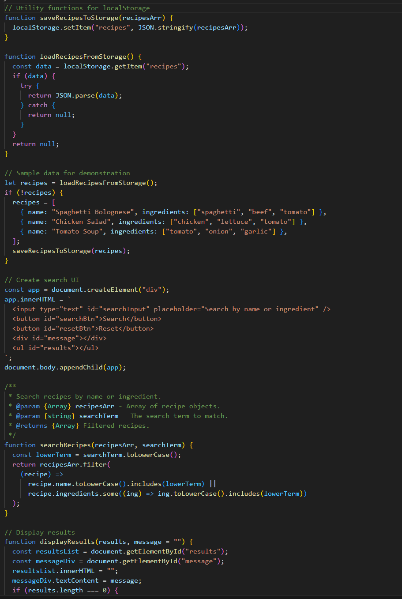
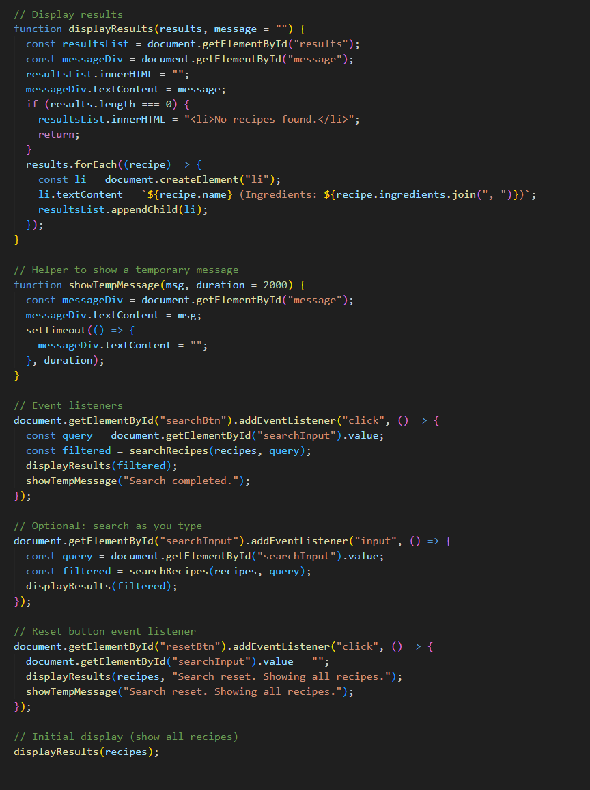

# NutriSnap

# Used Promts with respective Screenshots
--> US-01

Prompt 1:
" You need to do a CLI Recipe Creator following this instructions
1. Prompt the user for a recipe title
2. Prompt repeatedly for ingredients
3. Prompt repeatedly for cooking steps
4. After all input, print the recepie recipe (title, list of ingredients, numbered steps) to the CLI "

Prompt 2:
" Add some comments to the difficult parts of the code "

Screenshots of the code:

--> US-02

Prompt 1: 

I need to implement a requirement based on User Stories for a Recipe Management app. The user story is: As a user, I want to search for recipes by name or ingredient so I can quickly find what I need. First, create a search input and button that allows users to search recipes by name or ingredient. Also, display the filtered results below the search bar.

Prompt 2:

Now, i need to implement the search function. That is, a function that takes an array of recipe objects and a search term, and returns recipes where the name or ingredient includes the search term.

Prompt 3:

The user needs to be able to undo the search. Add a reset button that clears the search input and shows all recipes again. Display a message: "Search reset. Showing all recipes."

Prompt 4:

After a search or undo action, show a temporary confirmation message below the search bar.

Prompt 5:

We need to ensure that all data must be saved correctly and remain accessible afterward. Thus, store the list of recipes in localStorage and load it when the page reloads.

Screenshot of the final code:

--> US-03
Prompts:

1. Define a Recipe class and a sample list of recipes

2. Create a function to display all recipes on the main interface

3. add a functionality to add recipes

4. add a functionality to remove recipes

5. As a user, I want to see a compliance calendar to visualize my progress.

--> US-04

Prompts:
1. Add a delete button next to each recipe (or habit).

2. When clicked, remove that recipe/habit from the list and localStorage.

3. Save the deleted item in case the user wants to undo.

4. Provide an undo button that restores the most recently deleted item.

5. Show a temporary message confirming the deletion or undo action.

6. Ensure changes persist in localStorage.

# Lessons Learned:

You have to be very specific with the steps and the functions you need, or it will do extra things you haven't asked for
